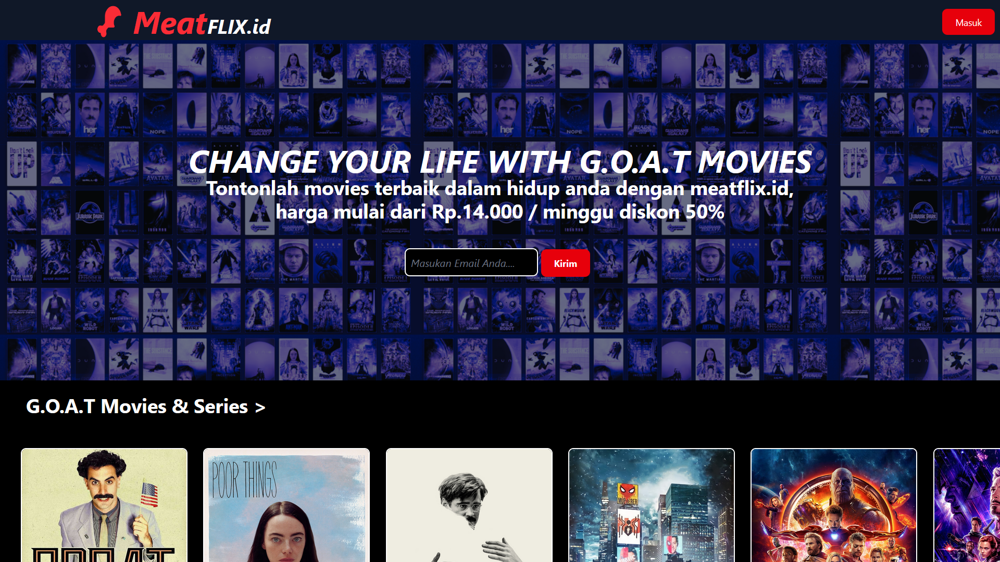

# 🍖 MeatFLIX.id here baby

MeatFLIX.id is a parody website of [netflix.com](netflix.com), this contains code that I made for my internship practice built using laravel 11 and tailwind 4.0., love dad ❤.




## 📥 How to install

1. Clone my repositories with link below

```bash
git clone https://github.com/azir999/meatflix
```
2. Install composer

```bash
composer install
```

3. Migration my database and seeder
```bash
php artisan migrate --seed
```

4. Get key

```bash
php artisan key:generate
```
5. Clone env

```bash
cp .env.example .env
```
6. Run css

```bash
npm install
npm run dev
```

7. Run website

```bash
php artisan serve
```

## 🔑 Login
Email:
```bash
admin@example.com
```
Password:
```bash
password
```

## 🚀 About Me
Im a
[bird...](https://www.github.com/azir999)


## enjoy 😁
